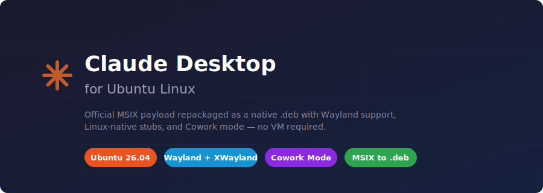

<p align="center">
  
</p>

# Claude Desktop for Ubuntu Linux

[](https://ubuntu.com/)
[](https://kernel.org/)
[](#wayland--x11)
[](#cowork-support)
[](#build)
[](LICENSE)

**Not a wrapper. Not a web view.** This takes the official Anthropic Windows MSIX, swaps in Linux-native stubs, adds Cowork support via [claude-cowork-linux](https://github.com/johnzfitch/claude-cowork-linux), and packages it as a `.deb`.

Tested on Ubuntu 26.04, kernel 7.0, NVIDIA RTX 5070, driver 580.

**Tags:** `claude-desktop` `ubuntu` `linux` `cowork` `wayland` `electron` `deb` `msix`

---

## Quick Jump

[Build](#build) | [Install](#install) | [Cowork](#cowork-support) | [Wayland](#wayland--x11) | [Doctor](#diagnostics) | [Limitations](#known-limitations) | [Credits](#credits)

---

## What It Does

The build script (`build-deb.sh`) takes a Windows MSIX and produces a `.deb`:

1. Extracts the MSIX (handles `.exe`, `.msix`, `.msixbundle`)
2. Pulls `app.asar` — the actual Electron app, untouched
3. Drops in a Linux `@ant/claude-native` stub (progress bar, flash frame, maximize detection via Electron's native APIs)
4. Clones [claude-cowork-linux](https://github.com/johnzfitch/claude-cowork-linux), installs its `@ant/claude-swift` stub and cowork helpers into the asar, patches the platform gate
5. Adds a bash launcher with display server detection and stale process cleanup
6. Packages icons, `.desktop` entry, and a `--doctor` diagnostic tool

## Build

```bash
git clone https://github.com/johnohhh1/claude-desktop-ubuntu.git
cd claude-desktop-ubuntu
./build-deb.sh --msix /path/to/Claude.msix
```

Also accepts `.msixbundle` or `.exe`:

```bash
./build-deb.sh --exe /path/to/Claude-Setup-x64.exe
```

Output: `dist/claude-desktop_<version>_amd64.deb`

### Prerequisites

```bash
sudo apt-get install -y dpkg-dev nodejs npm python3 file
```

**Source artifact note:** Prefer a real `.msix` or `.msixbundle`. Anthropic's newer `.exe` bootstrapper may not embed the full payload.

## Install

```bash
sudo apt install ./dist/claude-desktop_<version>_amd64.deb
```

## Launch

```bash
claude-desktop
```

Or find "Claude" in your app launcher.

---

## Cowork Support

Cowork runs Claude Code in a sandboxed session that can read/write a project folder. On macOS this happens inside a VM. On Linux, we skip the VM entirely — Claude Code runs directly on the host.

This approach comes from [**johnzfitch/claude-cowork-linux**](https://github.com/johnzfitch/claude-cowork-linux), which reverse-engineered the macOS Cowork layer and built JavaScript stubs to replace it. This deb integrates those stubs at build time:

| What | How |
|:-----|:----|
| `@ant/claude-swift` | Replaced with a JS stub that spawns Claude Code directly instead of booting a VM |
| Platform gate | Patched to return `{status: "supported"}` on Linux |
| VM paths | `/sessions/...` translated to `~/.config/Claude/local-agent-mode-sessions/sessions/...` |
| `/sessions` symlink | Created by postinst so the path translation works |

Full credit to **[@johnzfitch](https://github.com/johnzfitch)** for figuring this out. This project would not have Cowork without [claude-cowork-linux](https://github.com/johnzfitch/claude-cowork-linux).

---

## Wayland / X11

The launcher auto-detects your display server:

- **Wayland session** — defaults to X11 via XWayland (for global hotkey support)
- **`CLAUDE_USE_WAYLAND=1`** — forces native Wayland (global hotkeys won't work, but everything else does)
- **Niri** — auto-detected and forced to native Wayland (no XWayland support)
- **X11 session** — works as-is

## Launcher Cleanup

On every launch, the script automatically handles:

- **Stale `SingletonLock`** — detects if the locking PID is dead, removes the lock so the app can start
- **Orphaned `cowork-vm-service` daemons** — kills leftover processes from previous crashes
- **Stale cowork sockets** — removes dead Unix sockets in `$XDG_RUNTIME_DIR`

## Diagnostics

```bash
claude-desktop --doctor
```

Checks: installed package version, display server, Electron binary, SingletonLock state, MCP config JSON validity, Node.js availability, bubblewrap, and KVM access.

---

## Known Limitations

- **Computer Use** — Anthropic's screen control feature (`ComputerUseTcc`) is not registered on Linux. See [portal-use](https://github.com/johnohhh1/portal-use) for a Wayland-native MCP alternative.
- **`FileSystem.whichApplication`** — macOS-only API; throws non-fatal errors in logs. Doesn't break anything.
- **WebGL** — may log "blocklisted" on NVIDIA. Non-fatal.
- **Source artifact** — the Windows `.exe` bootstrapper may not contain the full MSIX payload. Use a `.msix` directly when possible.

---

## How It Differs

| Project | What it does |
|---------|-------------|
| [**johnzfitch/claude-cowork-linux**](https://github.com/johnzfitch/claude-cowork-linux) | Original Cowork-on-Linux solution. Extracts from macOS DMG, stubs `@ant/claude-swift`, patches the asar. Standalone install with its own launcher, test suite, and bubblewrap sandboxing. |
| **This project** | Takes the Windows MSIX instead, adds a `@ant/claude-native` Linux stub, integrates claude-cowork-linux's Cowork stubs, and packages it all as a `.deb`. |

## Credits

- **[@johnzfitch](https://github.com/johnzfitch)** / [claude-cowork-linux](https://github.com/johnzfitch/claude-cowork-linux) — Cowork stubs, `@ant/claude-swift` replacement, platform gate patch, path translation. MIT licensed.

## Related Projects

- [chatgpt_desktop_ubuntu](https://github.com/johnohhh1/chatgpt_desktop_ubuntu) — same MSIX-to-deb approach for ChatGPT Desktop
- [codex-ubuntu](https://github.com/johnohhh1/codex-ubuntu) — same approach for OpenAI Codex Desktop

## License

MIT — the build tooling and Linux-specific stubs in this repo.

The Claude Desktop app binary (`app.asar`) is Anthropic's proprietary software and is not included in this repository. Cowork stubs are from [claude-cowork-linux](https://github.com/johnzfitch/claude-cowork-linux) (MIT).

---

[github.com/johnohhh1/claude-desktop-ubuntu](https://github.com/johnohhh1/claude-desktop-ubuntu) — issues and PRs welcome.
